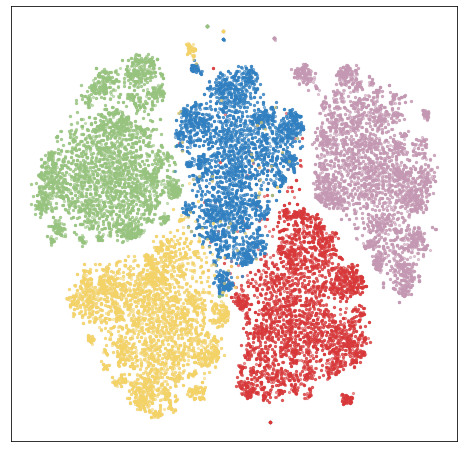

# DRUIC 
Implementation of "Fine-Grained Multi-Aspect Matching between Disentangled Representations of User Interests and Content for News Recommendation" (DASFAA 2024).

## Dataset
The origin dataset can be downloaded from https://msnews.github.io/index.html

For preprocessing of dataset utils, please refer to https://github.com/recommenders-team/recommenders/blob/main/examples/01_prepare_data/mind_utils.ipynb.

## Baselines

In this repository, we exclusively focus on news recommendation baselines and do not include traditional recommendation methods.

For some of the baselines, such as **DKN, NPA, LSTUR, and NRMS**, we utilized code from the https://github.com/recommenders-team/recommenders. 

For some other baselines which the authors had published the code, we utilized publicly available code. The following are the code links for these baselines:

**FUM** : https://github.com/taoqi98/FUM  \
**CAUM** : https://github.com/taoqi98/CAUM \
**FIM** : https://github.com/taoqi98/FIM \
**MINS** : https://github.com/whonor/MINS \
**MIECL** : https://github.com/wangsc2113/MIECL 

For the baseline without publicly available code, we reproduced it based on its paper, and you can find the reproduced code in the **Baselines** folder, which including **MCCM** and **MINER**. For fair comparison, we replace the BERT news encoder within MINER with pretrained Glove embedding vectors and self-attention networks.

Due to page limitations, we removed some experiments from the paper, which we show below:

